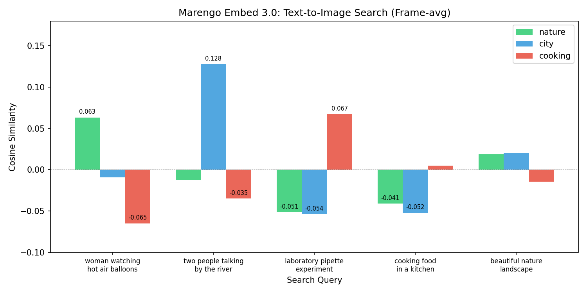
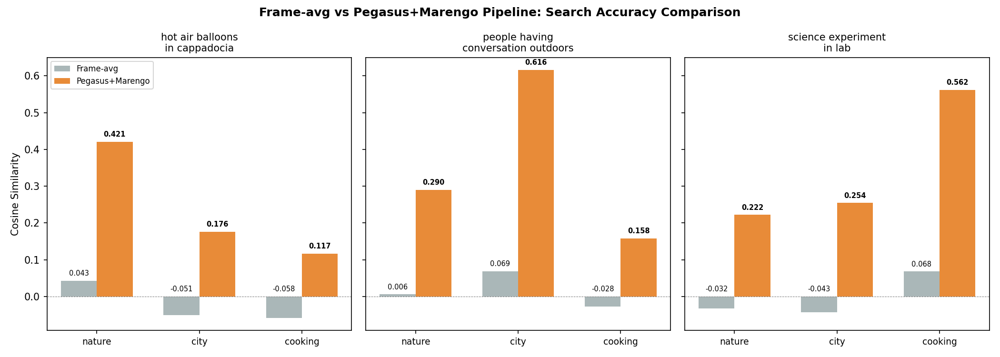

# Bedrock Twelve Labs PoC

Amazon Bedrock에서 [Twelve Labs](https://twelvelabs.io/) 모델을 활용한 비디오 이해(Video Understanding) 실험.
Pegasus v1.2 (비디오 언어 모델)와 Marengo Embed 3.0 (멀티모달 임베딩 모델)을 테스트하고,
**비디오 RAG 파이프라인**의 가능성을 검증합니다.

## 아키텍처


| 구성 요소 | 설명 |
|-----------|------|
| **Amazon S3** | 샘플 비디오 저장 (us-east-1) |
| **Pegasus v1.2** | 비디오를 보고 자연어 텍스트 생성 (요약, Q&A, 타임스탬프) |
| **Marengo Embed 3.0** | 텍스트/이미지를 512차원 벡터로 변환 |
| **Vector DB** | 임베딩 저장 및 유사도 검색 (OpenSearch, Pinecone 등) |

### Bedrock 모델 정보

| 모델 | Inference Profile ID | 입력 | 출력 | 리전 |
|------|---------------------|------|------|------|
| Pegasus v1.2 | `us.twelvelabs.pegasus-1-2-v1:0` | TEXT + VIDEO | TEXT | us-east-1, us-east-2, us-west-2 |
| Marengo Embed 3.0 | `us.twelvelabs.marengo-embed-3-0-v1:0` | TEXT + IMAGE | EMBEDDING (dim=512) | us-east-1 |

> **참고**: Marengo Embed는 Bedrock에서 **비디오 직접 임베딩을 지원하지 않습니다**.
> `image`와 `text` 입력만 가능하며, 비디오 임베딩이 필요한 경우 프레임 추출 또는
> Pegasus 설명 텍스트를 거치는 파이프라인이 필요합니다.

## 샘플 비디오

[Pexels](https://www.pexels.com/) CC0 라이선스 비디오 3종을 사용했습니다.

| 비디오 | 실제 내용 | 해상도 | 길이 | 대표 프레임 |
|--------|----------|--------|------|------------|
| `nature.mp4` | 카파도키아 열기구 감상 | 1920x1080 | 19.3s |  |
| `city.mp4` | 강변에서 대화하는 두 여성 | 1920x1080 | 37.9s |  |
| `cooking.mp4` | 실험실 피펫 작업 | 2560x1440 | 14.0s |  |

## 실험 1: Pegasus v1.2 - 비디오 이해

> `01_pegasus_video_qa.py`

Pegasus에 S3 비디오 URI와 프롬프트를 전달하여 4가지 태스크를 테스트합니다.


### Bedrock API 호출 형식

```python
body = {
    "inputPrompt": "이 비디오의 내용을 한국어로 자세히 설명해주세요.",
    "mediaSource": {
        "s3Location": {
            "uri": "s3://bucket/videos/nature.mp4",
            "bucketOwner": "123456789012",
        }
    },
}
response = bedrock.invoke_model(
    modelId="us.twelvelabs.pegasus-1-2-v1:0",
    contentType="application/json",
    accept="application/json",
    body=json.dumps(body),
)
# Response: {"message": "...", "stopReason": "stop"}
```

### 결과 샘플

**nature.mp4 - 영어 요약**
> The video opens with a static shot of a woman standing on a hilltop, facing away from
> the camera. She is dressed in a floral dress and has long hair. To her right, a red and
> white van is parked. The background showcases a stunning view of numerous hot air balloons
> floating in the sky, with the sun setting behind them, casting a warm glow over the scene.

**nature.mp4 - 한국어 요약**
> 이 비디오는 아침 일찍 페가수스 공원에서 열기구를 관찰하는 여성의 모습으로 시작됩니다.
> 여성은 오렌지색과 흰색의 구형 차량 옆에 서 있으며... 배경으로는 하늘을 날고 있는
> 여러 개의 열기구와 아름다운 풍경이 펼쳐져 있습니다.

**city.mp4 - 타임스탬프 추출**
> 1. [00:00-00:10] Two women are sitting on a wooden railing by the river, engaged in a conversation.
> 2. [00:10-00:20] The woman on the right continues to gesture with her hands while talking.
> 3. [00:20-00:30] The woman on the right continues to gesture and talk...
> 4. [00:30-00:37] The woman on the left continues to talk and gesture with her hands.

### 주요 발견

- 3개 비디오 x 4개 프롬프트 = **12건 모두 성공** (100% 성공률)
- **한국어 응답**: 자연스러운 한국어 생성 확인 (다만 일부 hallucination 존재)
- **타임스탬프**: `[MM:SS-MM:SS]` 형식으로 구간별 설명 제공
- **객체 인식**: 사람, 차량, 열기구, 노트북 등 주요 객체 정확히 식별
- cooking.mp4의 실제 내용(실험실 피펫)을 정확히 파악 (파일명에 속지 않음)

## 실험 2: Marengo Embed 3.0 - 멀티모달 임베딩

> `02_marengo_embed.py`

### Bedrock API 호출 형식

```python
# Text embedding
body = {"inputType": "text", "text": {"inputText": "search query"}}
# Image embedding
body = {"inputType": "image", "image": {"mediaSource": {"base64String": "..."}}}
# Response: {"data": [{"embedding": [float x 512]}]}
```

### Step 1: Text-to-Image 검색 (프레임 평균 임베딩)

비디오에서 4개 프레임을 추출하고, 각 프레임의 이미지 임베딩 평균으로 비디오를 표현합니다.



| 검색 쿼리 | 1위 (Score) | 2위 | 3위 |
|-----------|------------|-----|-----|
| "woman watching hot air balloons at sunset" | **nature** (0.063) | city (-0.009) | cooking (-0.065) |
| "two people talking by the river with laptops" | **city** (0.128) | nature (-0.012) | cooking (-0.035) |
| "laboratory pipette experiment with green liquid" | **cooking** (0.067) | nature (-0.052) | city (-0.054) |

**상대 순위는 정확하지만**, 절대 유사도 스코어가 매우 낮습니다 (0.06~0.13).
프레임 이미지만으로는 비디오의 맥락을 충분히 표현하지 못합니다.

### Step 2: Video-to-Video 유사도 매트릭스


프레임 평균 임베딩 간 cosine similarity. 모든 비디오 쌍이 0.74~0.79로 높은 유사도를 보여
**변별력이 부족**합니다.

### Step 3: Pegasus + Marengo 파이프라인 vs Frame-avg 비교

비디오를 Pegasus로 설명 텍스트를 생성한 후, 그 텍스트를 Marengo로 임베딩하는 파이프라인의 성능을 비교합니다.



| 검색 쿼리 | 방식 | nature | city | cooking |
|-----------|------|--------|------|---------|
| "hot air balloons in cappadocia" | Frame-avg | 0.043 | -0.051 | -0.058 |
| | **Pegasus+Marengo** | **0.421** | 0.176 | 0.117 |
| "people having conversation outdoors" | Frame-avg | 0.006 | 0.069 | -0.028 |
| | **Pegasus+Marengo** | 0.290 | **0.616** | 0.158 |
| "science experiment in lab" | Frame-avg | -0.032 | -0.043 | 0.068 |
| | **Pegasus+Marengo** | 0.222 | 0.254 | **0.562** |

### 핵심 결론

**Pegasus + Marengo 파이프라인이 Frame-avg 대비 약 5~10배 높은 유사도 스코어**를 보여줍니다.

- Frame-avg 최고 스코어: 0.069
- Pegasus+Marengo 최고 스코어: **0.616**
- 정확한 비디오를 1위로 매칭하는 비율: 두 방식 모두 3/3 (100%)이지만, 마진이 극적으로 다름

## 권장 아키텍처: 비디오 RAG 파이프라인

실험 결과를 기반으로, Bedrock에서 비디오 검색/RAG를 구축할 때 권장하는 패턴입니다.

```
[인덱싱 시점]
Video (S3)
  --> Pegasus v1.2: 비디오 설명 텍스트 생성
  --> Marengo Embed 3.0: 텍스트를 512차원 벡터로 변환
  --> Vector DB에 저장 (메타데이터: video_key, description, timestamps)

[검색 시점]
User Query (자연어)
  --> Marengo Embed 3.0: 쿼리를 512차원 벡터로 변환
  --> Vector DB에서 cosine similarity 검색
  --> Top-K 비디오 반환 + Pegasus로 상세 Q&A
```

## 프로젝트 구조

```
bedrock-twelvelabs/
  README.md
  01_pegasus_video_qa.py      # 실험 1: Pegasus 비디오 이해
  02_marengo_embed.py          # 실험 2: Marengo 임베딩 + 파이프라인
  generate_charts.py           # 결과 차트 생성
  generate_arch_diagram.py     # 아키텍처 다이어그램 생성
  videos/                      # 샘플 비디오 (Pexels CC0)
  frames/                      # 추출된 프레임 (git에서 제외, 실행 시 자동 생성)
  assets/                      # README 이미지 (charts, diagrams, samples)
```

## 실행 방법

```bash
# 필수 패키지
pip install boto3 numpy matplotlib cairosvg

# AWS 자격증명 설정 (us-east-1 접근 필요)
export AWS_DEFAULT_REGION=us-east-1

# 실험 1: Pegasus 비디오 Q&A
python 01_pegasus_video_qa.py

# 실험 2: Marengo 임베딩 + 파이프라인
python 02_marengo_embed.py

# 차트/다이어그램 재생성
python generate_charts.py
python generate_arch_diagram.py
```

## 참고 자료

- [Twelve Labs Documentation](https://docs.twelvelabs.io/)
- [AWS Blog: TwelveLabs video understanding models are now available in Amazon Bedrock](https://aws.amazon.com/blogs/aws/twelvelabs-video-understanding-models-are-now-available-in-amazon-bedrock/)
- [Amazon SageMaker HyperPod - Twelve Labs Case Study](https://aws.amazon.com/sagemaker/hyperpod/)
