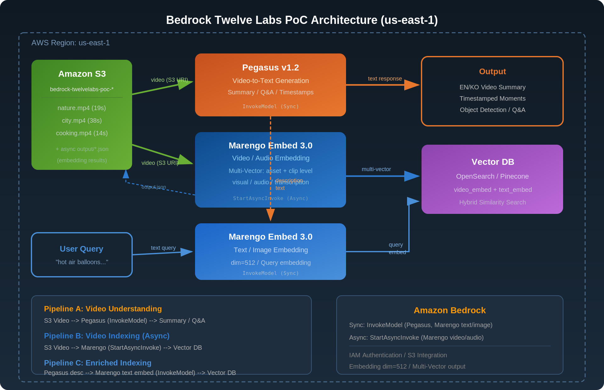
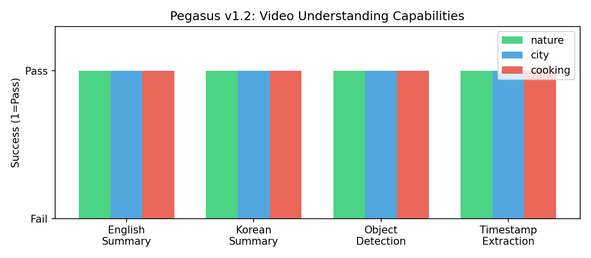
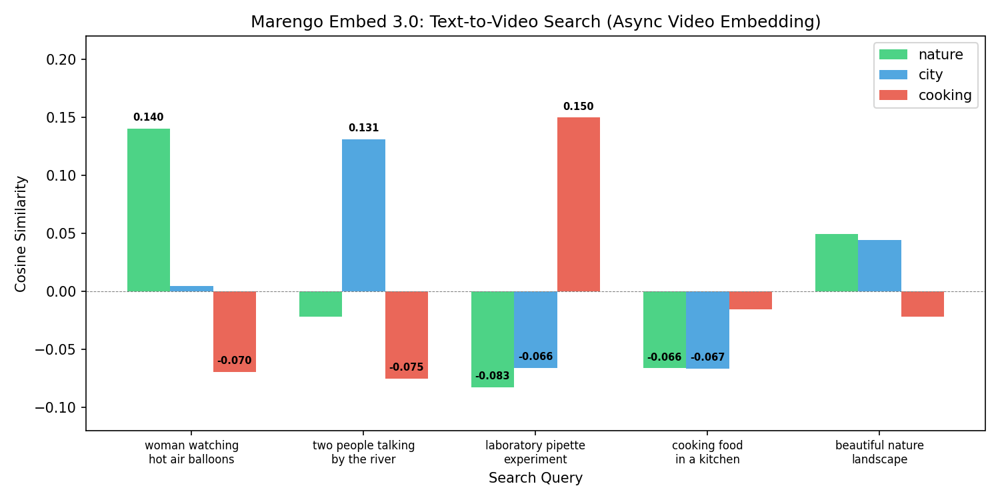
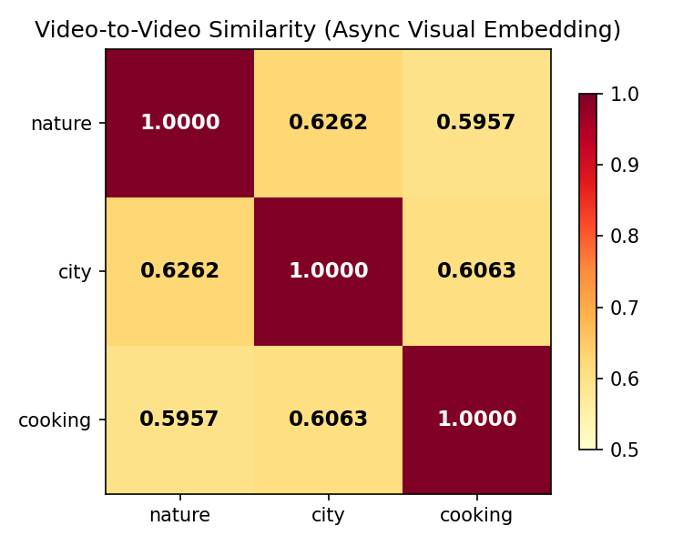
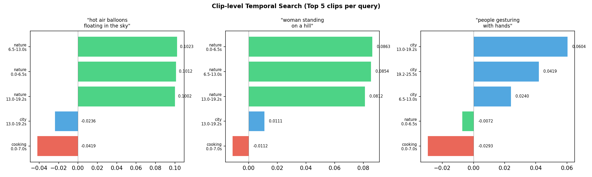
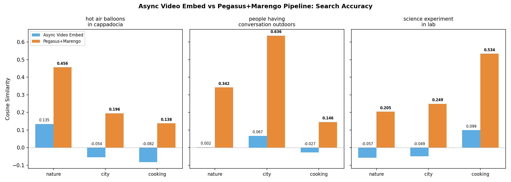
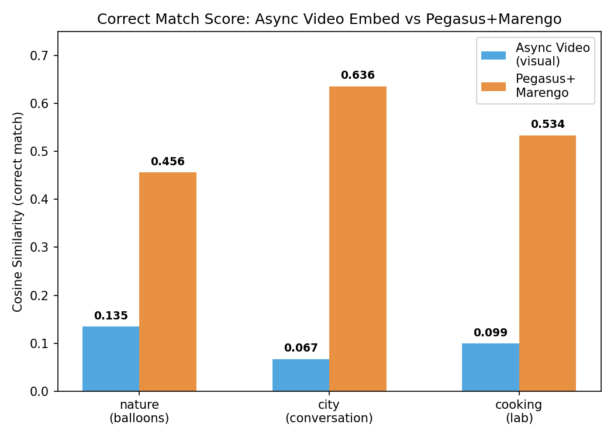

# Bedrock Twelve Labs PoC

Amazon Bedrock에서 [Twelve Labs](https://twelvelabs.io/) 모델을 활용한 비디오 이해(Video Understanding) 실험.
Pegasus v1.2 (비디오 언어 모델)와 Marengo Embed 3.0 (멀티모달 임베딩 모델)을 테스트하고,
**비디오 RAG 파이프라인**의 가능성을 검증합니다.

## 아키텍처



| 구성 요소 | 설명 |
|-----------|------|
| **Amazon S3** | 샘플 비디오 저장 (us-east-1) |
| **Pegasus v1.2** | 비디오를 보고 자연어 텍스트 생성 (요약, Q&A, 타임스탬프) |
| **Marengo Embed 3.0** | 비디오/텍스트/이미지를 512차원 벡터로 변환 |
| **Vector DB** | 임베딩 저장 및 유사도 검색 (OpenSearch, Pinecone 등) |

### Bedrock 모델 정보

| 모델 | Model ID | 입력 | 출력 | 리전 |
|------|----------|------|------|------|
| Pegasus v1.2 | `us.twelvelabs.pegasus-1-2-v1:0` | TEXT + VIDEO | TEXT | us-east-1, us-east-2, us-west-2 |
| Marengo Embed 3.0 | `us.twelvelabs.marengo-embed-3-0-v1:0` (Sync) / `twelvelabs.marengo-embed-3-0-v1:0` (Async) | TEXT, IMAGE, VIDEO, AUDIO | EMBEDDING (dim=512) | us-east-1 |

### Marengo Embed API 방식

Marengo Embed 3.0은 Bedrock에서 **비디오 직접 임베딩을 지원**합니다.
단, 동기/비동기 API에 따라 지원하는 입력 모달리티가 다릅니다:

| API 방식 | Bedrock API | 지원 입력 | 용도 |
|----------|------------|----------|------|
| **동기** (InvokeModel) | `us.twelvelabs.marengo-embed-3-0-v1:0` | Text, Image, Text+Image | 검색 쿼리 임베딩 (즉시 응답) |
| **비동기** (StartAsyncInvoke) | `twelvelabs.marengo-embed-3-0-v1:0` | Video, Audio, Image, Text | 대규모 에셋 인덱싱 |

비동기 비디오 임베딩은 **Multi-Vector** 결과를 반환합니다:
- **Asset-level**: 전체 비디오에 대한 visual / audio / transcription 임베딩 (3개)
- **Clip-level**: ~6.5초 단위 시간 구간별 동일 3종 임베딩 (N*3개)

## 샘플 비디오

[Pexels](https://www.pexels.com/) CC0 라이선스 비디오 3종을 사용했습니다.

| 비디오 | 실제 내용 | 해상도 | 길이 | 대표 프레임 |
|--------|----------|--------|------|------------|
| `nature.mp4` | 카파도키아 열기구 감상 | 1920x1080 | 19.3s |  |
| `city.mp4` | 강변에서 대화하는 두 여성 | 1920x1080 | 37.9s |  |
| `cooking.mp4` | 실험실 피펫 작업 | 2560x1440 | 14.0s |  |

## 실험 1: Pegasus v1.2 - 비디오 이해

> `01_pegasus_video_qa.py`

Pegasus에 S3 비디오 URI와 프롬프트를 전달하여 4가지 태스크를 테스트합니다.



### Bedrock API 호출 형식

```python
body = {
    "inputPrompt": "이 비디오의 내용을 한국어로 자세히 설명해주세요.",
    "mediaSource": {
        "s3Location": {
            "uri": "s3://bucket/videos/nature.mp4",
            "bucketOwner": "123456789012",
        }
    },
}
response = bedrock.invoke_model(
    modelId="us.twelvelabs.pegasus-1-2-v1:0",
    contentType="application/json",
    accept="application/json",
    body=json.dumps(body),
)
# Response: {"message": "...", "stopReason": "stop"}
```

### 결과 샘플

**nature.mp4 - 영어 요약**
> The video opens with a static shot of a woman standing on a hilltop, facing away from
> the camera. She is dressed in a floral dress and has long hair. To her right, a red and
> white van is parked. The background showcases a stunning view of numerous hot air balloons
> floating in the sky, with the sun setting behind them, casting a warm glow over the scene.

**nature.mp4 - 한국어 요약**
> 이 비디오는 아침 일찍 페가수스 공원에서 열기구를 관찰하는 여성의 모습으로 시작됩니다.
> 여성은 오렌지색과 흰색의 구형 차량 옆에 서 있으며... 배경으로는 하늘을 날고 있는
> 여러 개의 열기구와 아름다운 풍경이 펼쳐져 있습니다.

**city.mp4 - 타임스탬프 추출**
> 1. [00:00-00:10] Two women are sitting on a wooden railing by the river, engaged in a conversation.
> 2. [00:10-00:20] The woman on the right continues to gesture with her hands while talking.
> 3. [00:20-00:30] The woman on the right continues to gesture and talk...
> 4. [00:30-00:37] The woman on the left continues to talk and gesture with her hands.

### 주요 발견

- 3개 비디오 x 4개 프롬프트 = **12건 모두 성공** (100% 성공률)
- **한국어 응답**: 자연스러운 한국어 생성 확인 (다만 일부 hallucination 존재)
- **타임스탬프**: `[MM:SS-MM:SS]` 형식으로 구간별 설명 제공
- **객체 인식**: 사람, 차량, 열기구, 노트북 등 주요 객체 정확히 식별
- cooking.mp4의 실제 내용(실험실 피펫)을 정확히 파악 (파일명에 속지 않음)

## 실험 2: Marengo Embed 3.0 - 비디오 임베딩

> `02_marengo_embed.py`

### Bedrock API 호출 형식

```python
# [동기] 텍스트 임베딩 (검색 쿼리용) - InvokeModel
body = {"inputType": "text", "text": {"inputText": "search query"}}
response = bedrock.invoke_model(
    modelId="us.twelvelabs.marengo-embed-3-0-v1:0", ...
)
# Response: {"data": [{"embedding": [float x 512]}]}

# [비동기] 비디오 임베딩 (에셋 인덱싱용) - StartAsyncInvoke
body = {
    "inputType": "video",
    "video": {
        "mediaSource": {
            "s3Location": {
                "uri": "s3://bucket/videos/nature.mp4",
                "bucketOwner": "123456789012",
            }
        }
    },
}
response = bedrock.start_async_invoke(
    modelId="twelvelabs.marengo-embed-3-0-v1:0",
    modelInput=body,
    outputDataConfig={"s3OutputDataConfig": {"s3Uri": "s3://bucket/output/"}},
)
# 결과는 S3 output.json에 저장
# {"data": [{"embedding": [...], "embeddingScope": "asset|clip",
#            "embeddingOption": "visual|audio|transcription",
#            "startSec": 0.0, "endSec": 19.35}]}
```

### 비동기 비디오 임베딩 결과 구조

nature.mp4 (19.3초)에서 생성된 Multi-Vector 임베딩:

| Scope | Option | 구간 | dim |
|-------|--------|------|-----|
| asset | visual | 0.00-19.35s (전체) | 512 |
| asset | audio | 0.00-19.35s (전체) | 512 |
| asset | transcription | 0.00-19.35s (전체) | 512 |
| clip | visual | 0.00-6.50s | 512 |
| clip | visual | 6.50-13.00s | 512 |
| clip | visual | 13.00-19.25s | 512 |
| clip | audio | 0.00-6.50s | 512 |
| ... | ... | ... | ... |
| **총 12개 벡터** | | | |

### Step 1: Text-to-Video 검색 (비동기 비디오 임베딩)

비디오를 `StartAsyncInvoke`로 직접 임베딩하고, asset-level visual 벡터로 텍스트 쿼리와 비교합니다.



| 검색 쿼리 | 1위 (Score) | 2위 | 3위 |
|-----------|------------|-----|-----|
| "woman watching hot air balloons at sunset" | **nature** (0.140) | city (0.005) | cooking (-0.070) |
| "two people talking by the river with laptops" | **city** (0.131) | nature (-0.022) | cooking (-0.075) |
| "laboratory pipette experiment with green liquid" | **cooking** (0.150) | city (-0.066) | nature (-0.083) |

3개 쿼리 모두 **정확한 비디오를 1위로 매칭** (3/3). 스코어 마진도 Frame-avg 방식 대비 약 2배 개선.

### Step 2: Video-to-Video 유사도 매트릭스



비동기 비디오 임베딩(visual) 간 cosine similarity. 이전 frame-avg 방식(0.74~0.79)과 비교하면
비디오 간 유사도가 0.60~0.63으로 **변별력이 크게 향상**되었습니다.

### Step 3: Clip-level 시간 구간 검색

비동기 임베딩의 clip-level 벡터를 활용하면 **비디오 내 특정 시간 구간**까지 검색할 수 있습니다.



- "hot air balloons floating in the sky" → nature의 모든 클립이 top 3 (일관된 장면)
- "people gesturing with hands" → city의 13.0~19.2s 구간이 최고 스코어 (실제 제스처가 활발한 구간)

### Step 4: 비동기 비디오 임베딩 vs Pegasus+Marengo 파이프라인





**정답 비디오에 대한 cosine similarity (높을수록 좋음):**

| 검색 쿼리 | 비동기 비디오 임베딩 | Pegasus+Marengo |
|-----------|-------------------|----------------|
| "hot air balloons in cappadocia" → nature | 0.135 | **0.456** |
| "people having conversation outdoors" → city | 0.067 | **0.636** |
| "science experiment in lab" → cooking | 0.099 | **0.534** |

### 핵심 결론

| 방식 | 정답 매칭 | 평균 스코어 | 장점 | 단점 |
|------|----------|-----------|------|------|
| **비동기 비디오 임베딩** | 3/3 (100%) | 0.100 | 직접 임베딩, clip-level 시간 검색 가능 | 스코어 절대값 낮음 |
| **Pegasus+Marengo** | 3/3 (100%) | **0.542** | 높은 유사도 스코어, 설명 텍스트 재활용 | 2단계 호출 필요 |

- **비동기 비디오 임베딩**: 시간 구간 검색, 모달리티별 분석 등 **세밀한 검색**에 적합
- **Pegasus+Marengo 파이프라인**: 높은 유사도 스코어로 **대규모 비디오 라이브러리 검색**에 적합
- 실제 프로덕션에서는 **두 방식을 조합**하는 것이 최적 (비동기 임베딩 + 설명 텍스트 보조)

## 권장 아키텍처: 비디오 RAG 파이프라인

실험 결과를 기반으로, Bedrock에서 비디오 검색/RAG를 구축할 때 권장하는 패턴입니다.

```
[인덱싱 시점]
Video (S3)
  --> StartAsyncInvoke (Marengo Embed): 비디오 직접 임베딩 (multi-vector)
  --> Pegasus v1.2: 비디오 설명 텍스트 생성
  --> InvokeModel (Marengo Embed): 설명 텍스트 임베딩
  --> Vector DB에 저장 (video_embed + text_embed + metadata)

[검색 시점]
User Query (자연어)
  --> InvokeModel (Marengo Embed): 쿼리 텍스트 임베딩 (동기, 즉시 응답)
  --> Vector DB에서 hybrid search (video_embed + text_embed)
  --> Top-K 비디오 반환
  --> Pegasus로 상세 Q&A (선택적)
```

## 프로젝트 구조

```
bedrock-twelvelabs/
  README.md
  01_pegasus_video_qa.py      # 실험 1: Pegasus 비디오 이해
  02_marengo_embed.py          # 실험 2: Marengo 임베딩 (비동기 비디오 + 파이프라인)
  generate_charts.py           # 결과 차트 생성
  generate_arch_diagram.py     # 아키텍처 다이어그램 생성
  videos/                      # 샘플 비디오 (Pexels CC0)
  frames/                      # 추출된 프레임 (git에서 제외, 실행 시 자동 생성)
  assets/                      # README 이미지 (charts, diagrams, samples)
```

## 실행 방법

```bash
# 필수 패키지
pip install boto3 numpy matplotlib cairosvg

# AWS 자격증명 설정 (us-east-1 접근 필요)
export AWS_DEFAULT_REGION=us-east-1

# 실험 1: Pegasus 비디오 Q&A
python 01_pegasus_video_qa.py

# 실험 2: Marengo 임베딩 (비동기 비디오 + 파이프라인 비교)
python 02_marengo_embed.py

# 차트/다이어그램 재생성
python generate_charts.py
python generate_arch_diagram.py
```

## 참고 자료

- [Twelve Labs Documentation](https://docs.twelvelabs.io/)
- [AWS Blog: TwelveLabs video understanding models are now available in Amazon Bedrock](https://aws.amazon.com/blogs/aws/twelvelabs-video-understanding-models-are-now-available-in-amazon-bedrock/)
- [Amazon SageMaker HyperPod - Twelve Labs Case Study](https://aws.amazon.com/sagemaker/hyperpod/)
